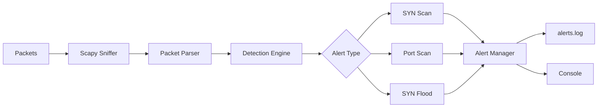
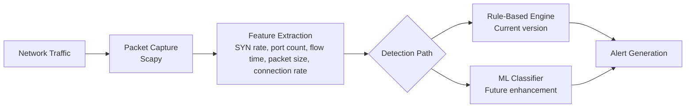

# network-ids

`network-ids` is a small passive intrusion detection tool written in Python. It watches TCP traffic on an interface and looks for three common patterns:

- SYN scan: one host sending SYNs very quickly
- Port scan: one host probing many distinct destination ports
- SYN flood: one destination receiving too many SYNs in a short time

The detector is intentionally simple. It uses sliding time windows and counters instead of ML or signature databases, which keeps the behavior easy to reason about and easy to test.

## Architecture



The control flow in `ids.py` is straightforward:

- `sniff()` captures TCP packets from the chosen interface
- `Detector.handle_packet()` filters non-IP and non-TCP packets, then ignores packets that are not pure SYNs
- `_check_syn_scan()` tracks SYN rate per source IP
- `_check_port_scan()` tracks distinct destination ports per source IP
- `_check_syn_flood()` tracks SYN volume per destination IP and port
- `_fire()` handles cooldowns, prints the alert, and appends it to `alerts.log`

## Detection Logic

The implementation in [`ids.py`](ids.py) uses these tunables:

- `SYN_SCAN_WINDOW` and `SYN_SCAN_THRESHOLD`
- `PORT_SCAN_WINDOW` and `PORT_SCAN_PORT_THRESHOLD`
- `FLOOD_WINDOW` and `FLOOD_THRESHOLD`
- `ALERT_COOLDOWN`
- `STATS_INTERVAL`

How each detector works:

1. SYN scan: count pure SYN packets from one source inside a short window.
2. Port scan: count distinct destination ports touched by one source inside a longer window.
3. SYN flood: count SYNs aimed at one destination IP and port inside a short window.

SYN-ACK packets are ignored so normal server replies do not look like scan traffic.

## Time Complexity

The core algorithms are intentionally small and efficient:

### SYN Scan

```text
Insert timestamp: O(1)
Remove expired entries: amortized O(1)
Detection check: O(1)
```

### Port Scan

```text
Hash map insert/update: O(1)
Prune stale ports: O(k) for the number of stale ports removed
Threshold check: O(1)
```

### SYN Flood

```text
Insert timestamp: O(1)
Remove expired entries: amortized O(1)
Detection check: O(1)
```

These choices matter because the detector runs on every matching packet. Keeping insertion and threshold checks constant-time makes the design practical for a lightweight passive IDS.

## Why This Architecture Works

This is a rule-based detector, so the architecture is intentionally small:

- One sniffing entry point keeps packet capture isolated.
- One detector class owns all state, which keeps the tests simple.
- Separate sliding windows prevent stale traffic from affecting current alerts.
- Alert cooldowns prevent repeated log spam from a single ongoing event.
- In-memory counters are enough for a learning project and make the behavior deterministic in tests.

## Running The Project

Install dependencies and start the detector:

```bash
pip install -r requirements.txt
sudo python3 ids.py -i eth0
```

Root access is needed because Scapy performs raw packet capture.

Useful flags:

- `-i` or `--iface`: interface to sniff on
- `--log`: file where alerts are written
- `--no-stats`: disable the periodic stats summary

## Trying It Locally

If you want to generate traffic against yourself in a safe lab environment, you can run:

```bash
sudo python3 ids.py -i lo &
nmap -sS -T4 127.0.0.1 -p 1-500
```

Depending on timing, you should see SYN_SCAN and/or PORT_SCAN alerts.

## Tests

Run the test suite with:

```bash
pip install pytest
pytest test_ids.py -v
```

The tests build Scapy packets in memory and call `Detector.handle_packet()` directly, so they do not need root or a live network interface.

## Known Limitations

- Thresholds are hardcoded and may need retuning on busier networks.
- Only IPv4 is supported right now.
- SYN flood detection does not distinguish spoofed traffic from legitimate spikes.
- State is memory-only, so a restart loses all history.
- There is no allowlist, so trusted scanners or gateways can still trigger alerts.

## Future Improvements

This project currently uses a rule-based detection engine based on sliding windows and predefined thresholds. Future work could improve its accuracy, scalability, and usability.

- Integrate machine learning, such as Random Forest or Isolation Forest, for anomaly detection and false-positive reduction.
- Support additional attack types such as ICMP floods, UDP floods, ARP spoofing, and brute-force attacks.
- Add a real-time dashboard for alerts and network statistics.
- Integrate with SIEM platforms such as Wazuh, Splunk, or Elastic Stack.
- Make detection thresholds configurable through JSON or YAML.
- Extend support to IPv6.
- Build a Mininet-based testing environment for repeatable evaluation.
- Optimize packet processing for higher traffic volumes.
- Use structured JSON logging.
- Containerize the application with Docker.

## Future Architecture


